

  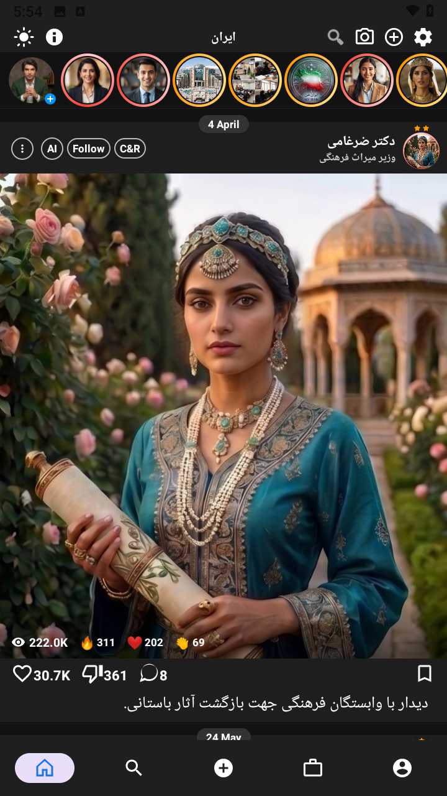
  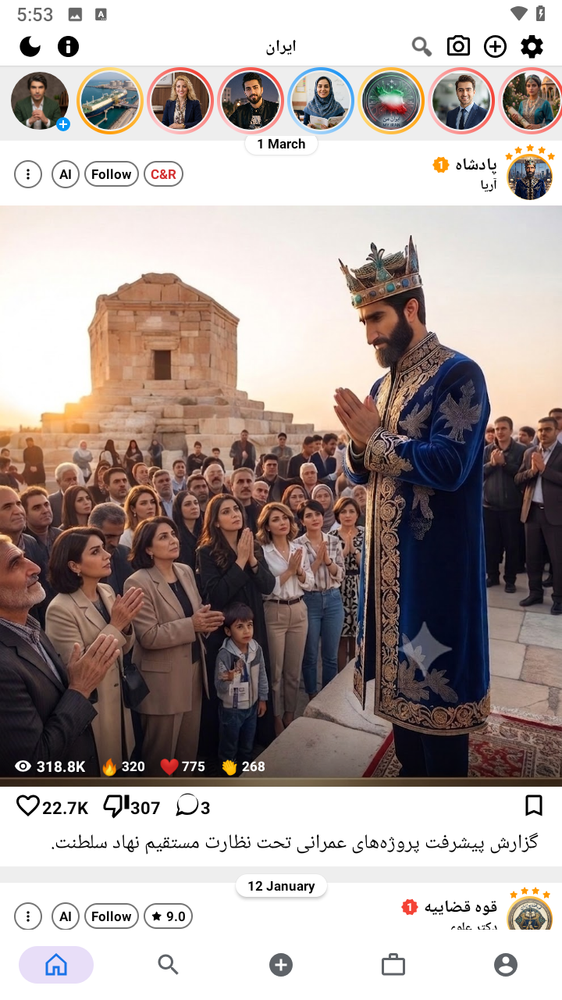
  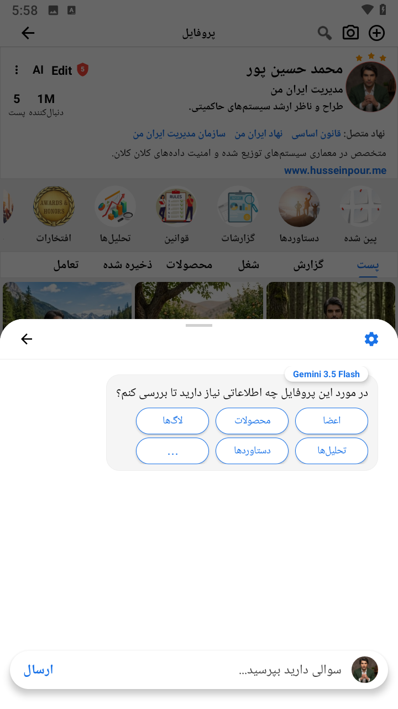
  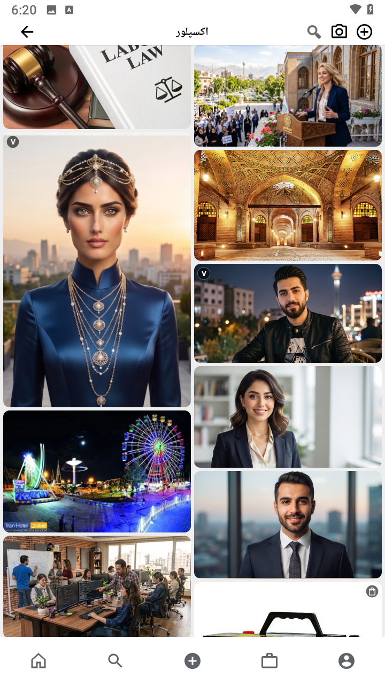
  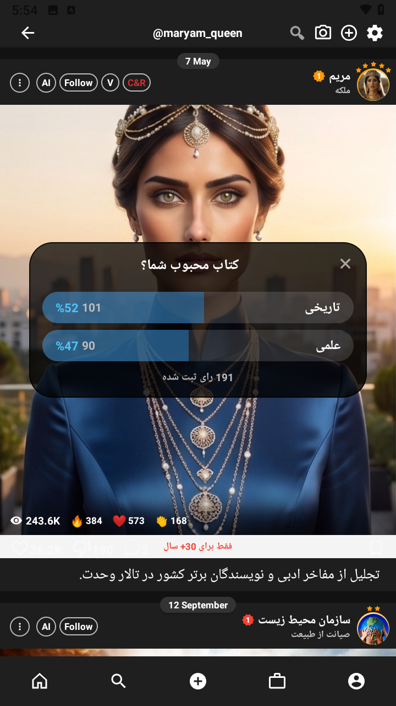

  
<b>مشاهده تصاویر بیشتر</b>

   
  

    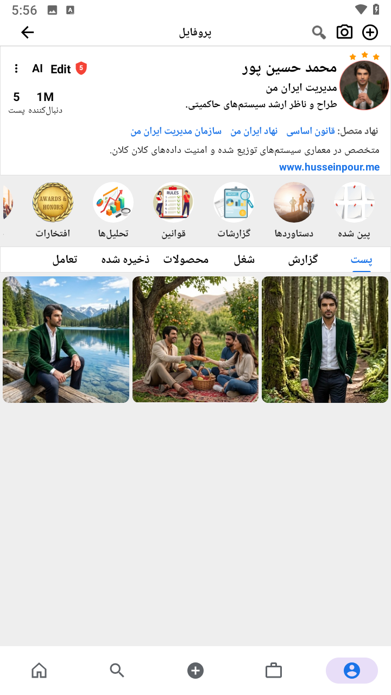
    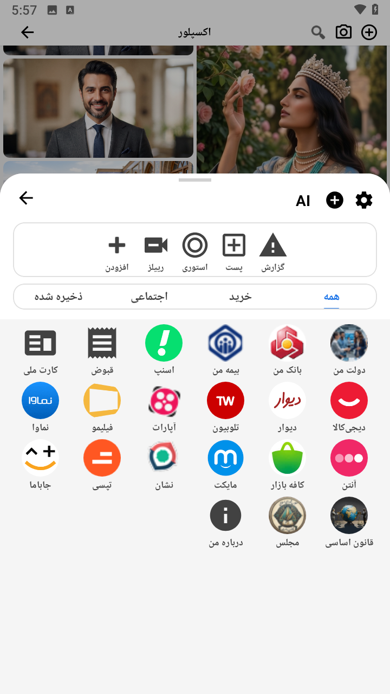
    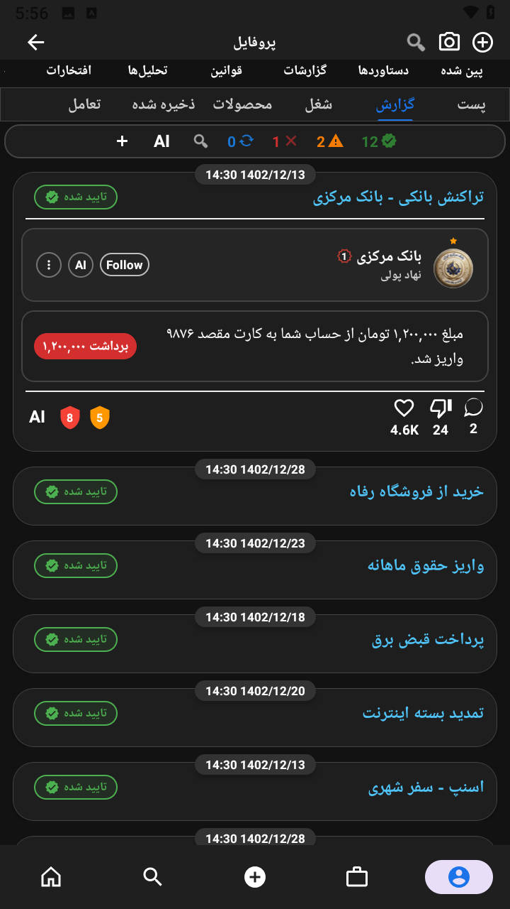
    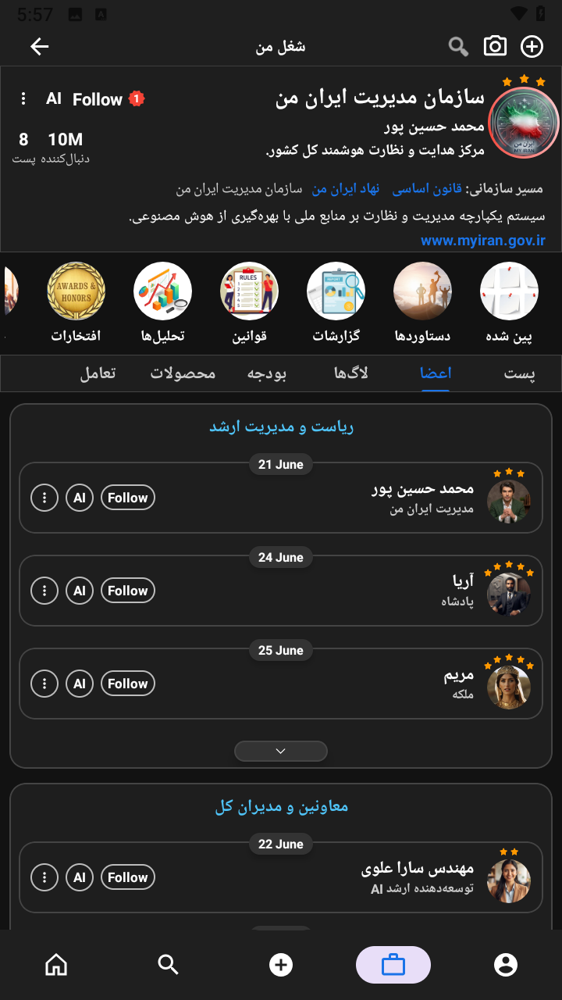
    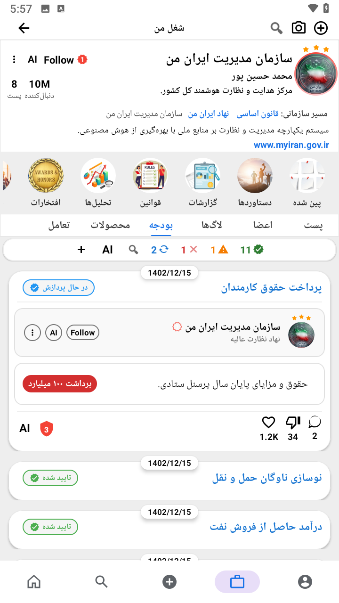
      
    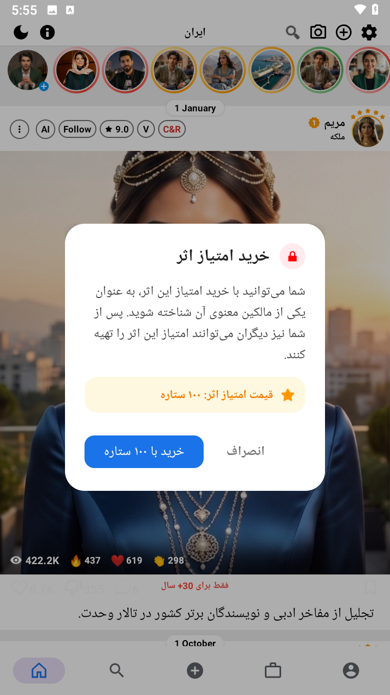
    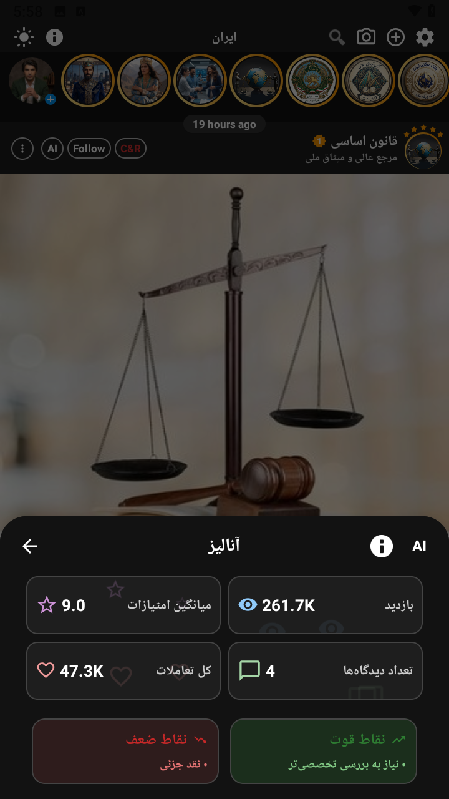
    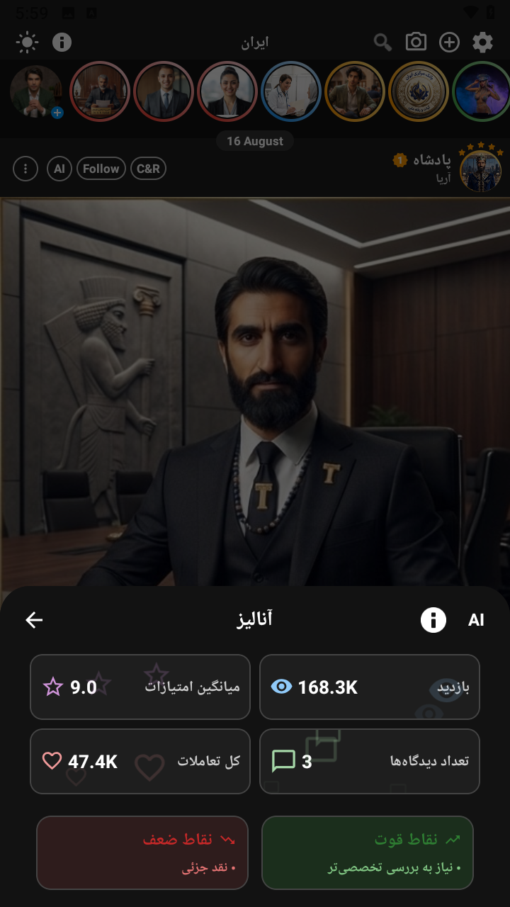
    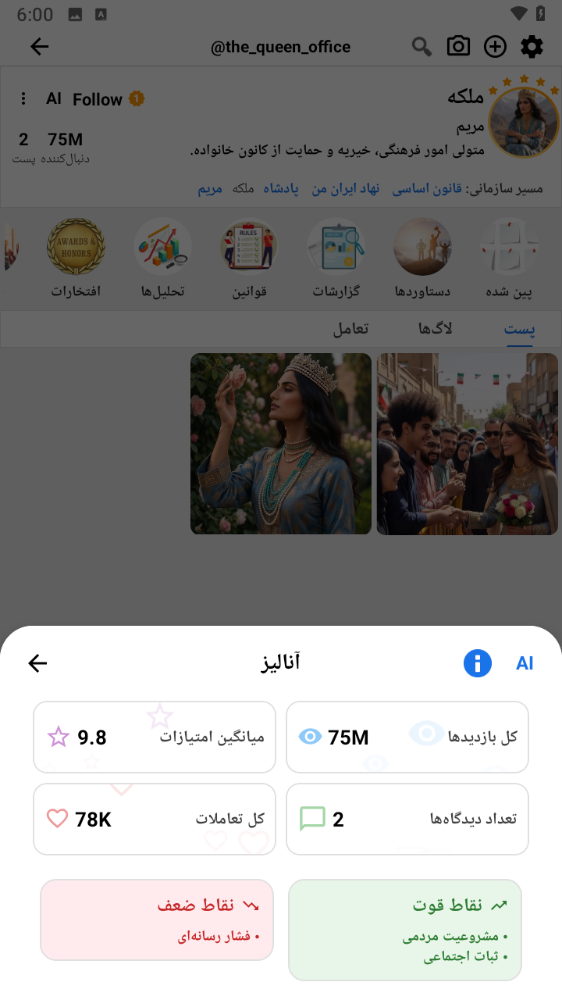
    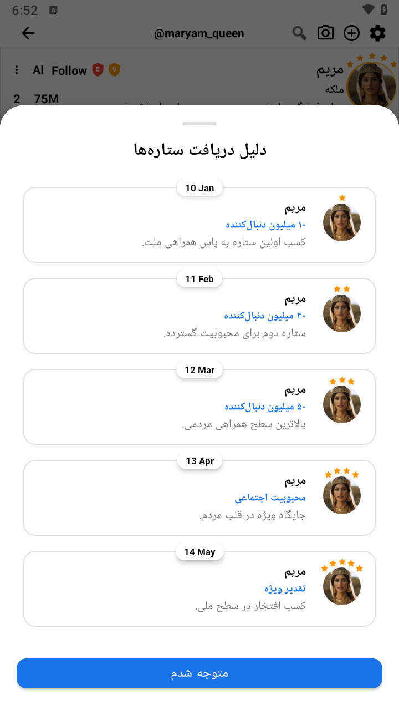
    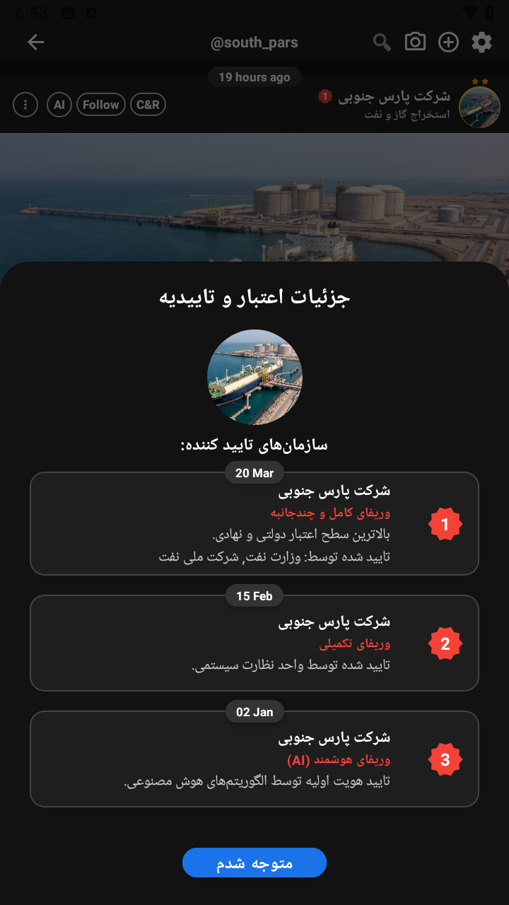
  

  

---
# پروژه «ایران من»
## حکمرانی دیجیتال مردمی، شفافیت حداکثری و عدالت به روش الگوریتم‌ها
## 🕊️ ایران من — میراثی برای «عزیزان»
## سخنی با صاحبان دردهای بی‌صدا آنان که جای خالی عزیزی را در سینه دارند
## می‌دانم گاهی در خلوت خود می‌پرسید:
## «آیا جان عزیز من بیهوده از دست رفت؟»
اطمینان می‌دهم: جان پاک عزیزان شما هرگز در دل این خاک به فراموشی سپرده نخواهد شد.
آن‌ها امانتی گران‌بها از عشق و ایستادگی را در سینه این سرزمین به یادگار گذاشتند؛ امانتی که ریشه دوانده و به نهالی از امید تبدیل شده است.
**«ایران من»** مراقب این نهال است تا روزی که به درختی تناور و سایه‌گستر از عدالت برسد.
---
# 🌟 ۱. چرا «ایران من»؟
«ایران من» یعنی یک انجمن، یک دورهمی شبانه، یک کاروان، یک خانواده؛ به دور از کینه از هم مراقبت می‌کنیم، اشتباه هم را با محبت اصلاح می‌کنیم، موفقیت‌ها را با هم جشن می‌گیریم و تصمیم‌ها را با یکدیگر می‌گیریم.
جایی که شفافیت، صداقت و دلسوزی حاکم باشد، وسوسه‌ها جایی برای رشد پیدا نمی‌کنند.
هدف «ایران من» ساختن یک برنامه ساده نیست؛ هدف، ایجاد یک **زیرساخت اعتماد دیجیتال** میان مردم، حکومت و خدمات عمومی است؛ زیرساختی که در آن فناوری در خدمت حقوق شهروندان قرار می‌گیرد و هیچ فرد یا نهاد واحدی نباید بتواند به‌تنهایی کنترل کامل سیستم را در اختیار داشته باشد.
---
# 🏛️ ۲. حکمرانی مردمی: قانون‌گذاری زنده
**قانون در این سیستم پتکی از بالا نیست که بر سر مردم فرود آید؛ توافقی زنده است که خود مردم، در چارچوب قانون اساسی و حقوق بنیادین، آن را شکل می‌دهند.**
* **قانون‌گذاری مردمی:** هر شهروند می‌تواند طرح کارشناسی‌شده‌ای ثبت کند و با کسب حدنصاب لازم از حمایت عمومی، آن را به مرحله بررسی و رأی‌گیری برساند. رأی‌گیری مستقیم با استفاده از سازوکارهای امن و قابل راستی‌آزمایی انجام می‌شود؛ مردم منبع اصلی مشروعیت قوانین هستند.
* **قوانین پویا:** هر قانون عادی می‌تواند تاریخ بازبینی و در صورت لزوم تاریخ انقضا داشته باشد تا نسل‌های بعد بتوانند متناسب با شرایط زمان خود آن را اصلاح، جایگزین یا لغو کنند. این پویایی فقط برای قوانین عادی است و اصول بنیادین قانون اساسی تابع رأی‌گیری روزمره نیستند.
* **مسئولان قابل تعویض:** نمایندگان و مسئولان، خدمتگزاران عمومی و پاسخگو در برابر مردم هستند. سازوکاری برای ارزیابی عملکرد، نظارت، اعتراض و در موارد قانونی برکناری آن‌ها وجود خواهد داشت. هیچ مسئولیتی نباید صرفاً به دلیل محبوبیت یا عدم محبوبیت فرد، به‌صورت خودکار از بین برود؛ تصمیم نهایی باید بر اساس مجموعه‌ای از شاخص‌های قابل اندازه‌گیری، قانون و فرآیند قانونی باشد.
* **شایسته‌سالاری:** برای هر جایگاه، سوابق تخصصی، تجربه، عملکرد، میزان پاسخگویی، تأییدیه‌های حرفه‌ای و سایر معیارهای مرتبط بررسی می‌شوند. ارزیابی باید ترکیبی از داده‌های واقعی، نظر مردم و بررسی مستقل باشد و هیچ شاخص واحدی نباید به‌تنهایی تعیین‌کننده شایستگی یک فرد باشد.
* **قانون طلایی:** حکومت و مسئولان، مجریان و خدمتگزاران مردم هستند. مردم حق دارند عملکرد آنان را ارزیابی کنند، درباره تصمیم‌های آنان اعتراض کنند و در چارچوب قانون در انتخاب، ادامه فعالیت یا برکناری آنان نقش داشته باشند.
## 📜 بنیان تغییرناپذیر در قانون اساسی
نگارش و تصویب بنیان تغییرناپذیر در قانون اساسی
* **نگارش توسط افراد شایسته:** متن اولیه توسط مجموعه‌ای متنوع از متخصصان حقوق، اقتصاد، جامعه‌شناسی، مدیریت، علوم سیاسی و سایر حوزه‌های مرتبط تهیه می‌شود. این افراد باید از مسیرهای شفاف و قابل بررسی انتخاب شوند و هیچ گروه یا نهاد واحدی نباید اختیار انحصاری تدوین قانون اساسی را داشته باشد.
* **نقش هوش مصنوعی در این مرحله:** هوش مصنوعی صرفاً نقش پژوهشی و مشورتی دارد؛ از جمله تحلیل داده‌ها، مقایسه تجربه قانون اساسی کشورهای مختلف، شناسایی تناقض‌های احتمالی، بررسی پیامدهای احتمالی مواد مختلف و ارائه پیشنهادهای پژوهشی.
تصمیم درباره ارزش‌ها، حقوق، ساختار حکومت و متن نهایی همیشه بر عهده انسان‌ها و در نهایت مردم خواهد بود.
* **تأیید نهایی با مردم:** پیش‌نویس قانون اساسی باید پیش از رأی‌گیری نهایی به زبان ساده برای عموم توضیح داده شود. مردم باید فرصت کافی برای مطالعه، نقد، پیشنهاد اصلاح و گفت‌وگو داشته باشند و در نهایت با رأی مستقیم آن را تصویب کنند.
* **حقوق بنیادین و تغییرناپذیر:** قانون اساسی باید مجموعه‌ای محدود اما روشن از حقوق بنیادین را مشخص کند که با رأی‌گیری عادی قابل لغو نباشند؛ از جمله حق حیات، منع شکنجه، آزادی عقیده و بیان، حقوق اقلیت‌ها، کرامت انسانی، برابری در برابر قانون و سایر حقوق بنیادین.
این اصول باید سقف محافظ کل سیستم باشند؛ حتی در برابر تصمیم اکثریت.
* **حدنصاب ویژه برای تغییر اصول بنیادین:** اگر جامعه در آینده بخواهد یکی از این اصول را تغییر دهد، این تغییر نباید با یک رأی‌گیری عادی امکان‌پذیر باشد. مردم باید در مرحله تدوین قانون اساسی، یک فرآیند بسیار سخت، چندمرحله‌ای و زمان‌بر برای چنین تغییراتی تعیین کنند.
* **مرز روشن بین دو سرعت قانون‌گذاری:** قوانین عادی و ویژگی‌های برنامه می‌توانند با بازخورد و رأی‌گیری عمومی نسبتاً سریع تغییر کنند؛ اما اصول بنیادین قانون اساسی فقط از مسیر یک فرآیند ویژه، شفاف و بسیار سخت‌گیرانه قابل تغییر خواهند بود.
---
# 🛡️ نهادها و سازوکارهای اجرایی
* **حدنصاب تغییر اصول بنیادین:** برای نمونه می‌توان ۷۵٪ رأی مثبت، در سه دور جداگانه با حداقل شش ماه فاصله و مشارکت حداقل ۶۰٪ واجدان رأی را در نظر گرفت. این اعداد صرفاً نمونه هستند و مقدار نهایی باید در فرآیند تدوین قانون اساسی تعیین شود.
ناکامی هر یک از شرایط باید باعث توقف فرآیند تغییر شود.
* **سنجش شایستگی نمایندگان:** برای مثال، ارزیابی می‌تواند توسط مجموعه‌ای ترکیبی از دانشگاه‌ها و مراکز علمی، انجمن‌ها و نهادهای حرفه‌ای، نهادهای مدنی و ناظران مستقل انجام شود.
هیچ منبع واحدی نباید اختیار تأیید یا رد یک فرد را به‌تنهایی داشته باشد.
* **معماری داده:** هویت، سلامت، بانک، مالیات و رأی باید در سامانه‌های جداگانه و با سطوح دسترسی مستقل نگهداری شوند، نه در یک پایگاه داده واحد.
ارتباط میان این سامانه‌ها فقط در صورت نیاز قانونی و برای یک عملیات مشخص انجام می‌شود و شهروند باید بتواند تا حد امکان مشاهده کند چه نهادی، چه زمانی و برای چه هدفی به اطلاعات او دسترسی پیدا کرده است.
* **رأی مخفی واقعی:** با استفاده از رمزنگاری پیشرفته، اثبات دانش صفر و رأی‌گیری قابل راستی‌آزمایی، می‌توان واجد شرایط بودن فرد را بدون اتصال هویت او به محتوای رأی تأیید کرد.
هر شهروند باید بتواند از ثبت صحیح رأی خود اطمینان حاصل کند، بدون اینکه بتواند به دیگران ثابت کند به چه فرد یا گزینه‌ای رأی داده است؛ زیرا امکان اثبات محتوای رأی می‌تواند زمینه خرید و فروش رأی یا اجبار رأی‌دهنده را ایجاد کند.
* **دادگاه قانون اساسی:** نهادی مستقل با اعضایی دارای دوره‌های ثابت و سازوکارهای جلوگیری از وابستگی سیاسی باید بر رعایت قانون اساسی و حقوق بنیادین نظارت کند.
این نهاد باید بتواند نقض اصول بنیادین را حتی در صورت وقوع توسط بالاترین مقام یا خود سامانه تشخیص دهد و در چارچوب قانون، تصمیم لازم‌الاجرا صادر کند.
---
# 🛡️ ۳. سپر دیجیتال کودکان و آزادی اطلاعات بزرگسالان
## برای کودکان — محیطی امن و سازنده
* **رده‌بندی هوشمند سنی:** حساب کودکان باید دارای سطح سنی مشخص باشد و دسترسی به محتوا بر اساس سن، مرحله رشد و تنظیمات قانونی و خانوادگی مدیریت شود.
* **حفاظت در برابر محتوای آسیب‌زا:** سامانه می‌تواند با استفاده از هوش مصنوعی، محتوای مستهجن، خشونت‌آمیز یا بالقوه آسیب‌زا را برای کودکان شناسایی و مسدود کند و در محیط کودکان، ارتباط مستقیم افراد ناشناس با کودک را محدود سازد.
* **تشویق رشد و خلاقیت:** کودکان به جای محتوای بی‌ارزش، می‌توانند به آموزش، بازی‌های فکری و محتوای علمی و هنری هدایت شوند و برای فعالیت‌های سازنده مانند نقاشی، اختراع و خلاقیت، امتیازهای تشویقی دریافت کنند.
* **آرامش والدین:** ابزارهای هوشمند می‌توانند به والدین در شناسایی خطرهای احتمالی، تغییرات رفتاری و محتوای نامناسب کمک کنند؛ اما هوش مصنوعی نباید جایگزین والدین، روان‌شناس یا متخصص انسانی شود و نباید به‌صورت مستقل درباره وضعیت روانی کودک حکم قطعی صادر کند.
---
## برای بزرگسالان — آزادی دسترسی به اطلاعات
فیلترینگ محتوایی ویژه کودکان طراحی شده است.
هیچ مقام یا نهادی نباید بتواند صرفاً بر اساس سلیقه شخصی، دسترسی بزرگسالان به اطلاعات را محدود کند.
هرگونه محدودیت قانونی برای بزرگسالان باید دارای مبنای روشن قانونی، هدف مشخص، ضرورت، تناسب، امکان اعتراض و سازوکار نظارت قضایی باشد.
تا حد امکان، تصمیم درباره محدودیت‌های عمومی باید از مسیر قانون‌گذاری شفاف و قابل بازبینی انجام شود.
> در «ایران من»، محدودیت‌های عمومی نباید ابزار سلیقه شخصی هیچ فرد یا نهادی باشند؛ قانون، حقوق بنیادین و نظارت مستقل باید مرزهای آن را مشخص کنند.
---
# 🚨 ۴. دکمه گزارش فوری
* **یک کلیک تا گزارش:** از چاله خیابان و لوله ترکیده تا مشکلات شهری، موارد انتظامی، تخلف اداری یا حتی ایده و اثر هنری، شهروند می‌تواند با یک عکس یا ویدیو و چند مرحله ساده گزارش خود را ثبت کند.
* **مسیریاب هوشمند:** لازم نیست شهروند بداند گزارش مربوط به شهرداری، پلیس یا سازمان دیگری است. هوش مصنوعی می‌تواند تصویر و متن گزارش را تحلیل کند و پیشنهاد دهد گزارش به کدام نهاد ارسال شود.
تصمیم نهایی درباره مسیر قانونی گزارش باید طبق قوانین و ساختار مسئولیت سازمان‌ها انجام شود.
گزارش می‌تواند شامل موقعیت مکانی، زمان و نوع مشکل باشد و اطلاعات حساس باید رمزنگاری و حداقل‌سازی شوند.
* **پرونده‌های شیشه‌ای:** هر گزارش دارای وضعیت مشخصی مانند «ارسال‌شده»، «در حال بررسی»، «اقدام‌شده» یا «بسته‌شده» خواهد بود.
اگر مهلت قانونی نهاد مسئول به پایان برسد، سامانه می‌تواند هشدار ایجاد کند و موضوع را به سطح نظارتی بالاتر ارجاع دهد.
تکرار تأخیرها و عدم رسیدگی می‌تواند در ارزیابی عملکرد سازمان یا مسئول مربوطه اثر بگذارد.
---
# ⭐ ۵. ارزیابی مسئولان: سامانه ارزیابی چندمعیاره
هر مسئول، از وزیر تا شهردار، پروفایلی عمومی و قابل بررسی خواهد داشت.
اما عملکرد او نباید صرفاً با محبوبیت عمومی سنجیده شود؛ ارزیابی باید ترکیبی از نظرِ تخصصی و نظرِ مردمی باشد، به‌گونه‌ای که هیچ‌کدام به‌تنهایی تعیین‌کننده نباشند.
معیارهای ارزیابی می‌توانند شامل موارد زیر باشند:
شفافیت، پاسخگویی، اجرای وعده‌ها، کارآمدی، کیفیت خدمات، رعایت قانون، استفاده صحیح از بودجه، نوآوری، رضایت عمومی و نتایج ممیزی مستقل.
منابعِ ارزیابی: سنجشِ این معیارها نباید صرفاً بر عهده‌ی یک نهاد باشد. ترکیبی از دانشگاه‌ها و مراکز علمی، انجمن‌ها و نهادهای حرفه‌ایِ مرتبط با هر حوزه، نهادهای مدنی، ناظرانِ مستقل، و رضایتِ عمومیِ شهروندان باید در کنارِ هم و به‌صورتِ شفاف در ارزیابیِ نهایی دخیل باشند. هیچ منبعِ واحدی — نه یک نهادِ علمی، نه یک نظرسنجی، نه یک مقامِ بالادستی — نباید اختیارِ تعیین یا تغییرِ سرنوشتِ یک مسئول را به‌تنهایی داشته باشد.
شفافیتِ روشِ ترکیب: نحوه‌ی وزن‌دهی و ترکیبِ این معیارها (برای مثال چقدر سهمِ ارزیابیِ علمی/تخصصی است و چقدر سهمِ رضایتِ عمومی) باید از پیش، به‌صورتِ عمومی و قابلِ‌بررسی منتشر شود، نه پس از هر ارزیابی به‌صورتِ موردی تعیین شود. این روشِ ترکیب خود باید تابعِ قانون و قابلِ اصلاح از طریقِ فرآیندِ قانون‌گذاریِ رسمی باشد، نه تصمیمِ یک‌جانبه‌ی فنی یا اجرایی.
محبوبیتِ عمومی تنها یکی از شاخص‌هاست و نباید به‌تنهایی باعثِ ارتقا، تنبیه یا عزلِ یک مسئول شود.
هوش مصنوعی و افکار عمومی: هوش مصنوعی می‌تواند حجمِ زیادی از نظراتِ عمومی را تحلیل کند و الگوهای نارضایتی یا رضایت را شناسایی نماید.
اما تحلیلِ احساساتِ مردم فقط یک شاخصِ آماری در کنارِ سایرِ منابعِ ارزیابی است و نباید به‌تنهایی باعثِ مجازات، عزل یا کاهشِ حقوقِ یک مسئول شود؛ نتیجه‌ی این تحلیل باید در کنارِ ارزیابیِ نهادهای علمی/تخصصی دیده شود، نه جایگزینِ آن.
کشفِ اولویت‌های مردم: شناساییِ موضوعاتِ پرتکرار مانند آلودگیِ هوا، گرانی، حمل‌ونقل یا کمبودِ خدمات می‌تواند اولویت‌های عمومی را به مسئولانِ مربوطه منتقل کند
مسیرِ گفت‌وگو: مسئولان می‌توانند صفحه‌ی عمومی داشته باشند و مردم بتوانند نظر، نقد و پیشنهادِ خود را در آن ثبت کنند.
ارتباطاتِ خصوصی نیز باید تابعِ قوانینِ حریمِ خصوصی، امنیت و مسئولیت‌پذیری باشد و هوش مصنوعی نباید بدونِ مبنای قانونی و اطلاع‌رسانیِ مناسب، ارتباطاتِ خصوصیِ افراد را به‌صورتِ نامحدود رصد کند.

---
# 💎 ۶. شفافیت مالی: خزانه شیشه‌ای
* **چرخه عمر یک تومان:** از درآمدهای نفت، مالیات، انرژی، گمرک و سایر درآمدهای عمومی تا نحوه تخصیص و هزینه‌کرد آن، اطلاعات عمومی مالی باید تا حد امکان قابل مشاهده و قابل پیگیری باشد.
اطلاعات محرمانه، امنیتی یا اطلاعات شخصی شهروندان نباید صرفاً به دلیل شفافیت مالی عمومی شوند.
هر تراکنش عمومی باید تا حد ممکن دارای سابقه و سند قابل بررسی باشد.
برای مثال می‌توان مسیر بودجه نوسازی اتوبوس‌ها را از تصویب بودجه تا قرارداد، پرداخت، تحویل و گزارش نهایی مشاهده کرد.
* **تخصیص مرحله‌ای:** بودجه پروژه‌های بزرگ می‌تواند به مراحل مشخص تقسیم شود و پرداخت مرحله بعد به ثبت و تأیید گزارش عملکرد مرحله قبل وابسته باشد.
در صورت وجود تخلف یا نقص، پرداخت بعدی می‌تواند طبق قانون و پس از بررسی انسانی و نهادی متوقف یا محدود شود.
* **فهرست سوابق غیرقابل حذف:** عملیات مالی مهم باید به‌صورت سوابق رمزنگاری‌شده و دارای اثر انگشت دیجیتال ثبت شوند تا حذف یا تغییر مخفیانه آن‌ها قابل تشخیص باشد.
اگر مبلغ فاکتور با قیمت‌های مرجع بازار ناسازگار باشد یا الگوی غیرعادی در پرداخت‌ها مشاهده شود، هوش مصنوعی می‌تواند آن را به‌عنوان مورد نیازمند بررسی علامت‌گذاری کند.
برچسب «مشکوک به رانت» باید به معنای **هشدار برای بررسی** باشد، نه حکم قطعی جرم.
---
# 🤖 ۷. هوش مصنوعی: تحلیل‌گر، دیده‌بان و بازوی اقدام احتیاطی
قلب تصمیم‌گیری «ایران من» هوش مصنوعی نیست.
هوش مصنوعی یک **ابزار تحلیل بسیار قدرتمند** است که می‌تواند حجم عظیمی از اطلاعات را بررسی کند، الگوهای غیرعادی را پیدا کند و موضوعات مهم را برای بررسی انسانی مشخص نماید.
هیچ الگوریتمی ذاتاً بی‌طرف و خطاناپذیر نیست؛ بنابراین مدل‌های هوش مصنوعی باید قابل آزمون، ممیزی، پایش و در موارد لازم قابل توضیح باشند.
نقش هوش مصنوعی در سه مرحله تعریف می‌شود:
### ۱. تشخیص
هر گزارش، تراکنش یا الگوی داده‌ای را بر اساس قوانین و مدل‌های آماری بررسی می‌کند و موارد مشکوک را شناسایی می‌کند.
برای مثال می‌تواند الگوهای غیرعادی مالی، احتمال پول‌شویی، تضاد منافع یا رفتار غیرمعمول در قراردادهای عمومی را شناسایی کند.
### ۲. اقدام احتیاطی فوری و قابل برگشت
در شرایطی که قانون از قبل اجازه داده باشد، سامانه می‌تواند در برابر یک خطر فوری، اقدامات موقت و محدود انجام دهد.
برای مثال:
* توقف موقت یک پرداخت خاص
* محدود کردن موقت یک عملیات حساس
* ایجاد هشدار امنیتی
* ارجاع فوری پرونده
* حفظ اسناد و شواهد برای جلوگیری از حذف یا دستکاری
هر اقدام خودکار باید دارای محدودیت زمانی، مبنای قانونی، امکان اعتراض و سازوکار بررسی انسانی باشد.
هوش مصنوعی نباید به‌تنهایی حکم به مجرم بودن فرد یا سازمان بدهد.
### ۳. تصمیم نهایی با انسان و نهاد پاسخگو
هر اقدام مهم و دائمی باید به بررسی یک انسان یا نهاد قانونی پاسخگو برسد.
فقط مرجع انسانی و قانونی مجاز می‌تواند تصمیم نهایی، دائمی یا قابل مجازات اتخاذ کند.
هیچ مجازات نهایی و غیرقابل برگشتی نباید صرفاً بر اساس خروجی یک مدل هوش مصنوعی اجرا شود.
همچنین هوش مصنوعی:
* گزارش ناشناس تخلف را می‌پذیرد و با استفاده از معماری مناسب، هویت گزارش‌دهنده را تا حد امکان از افراد غیرمجاز پنهان نگه می‌دارد.
* می‌تواند محتوایی را که بدون اجازه از آثار دارای مالکیت فکری کپی شده شناسایی کند؛ اما حذف نهایی محتوا باید بر اساس قانون، فرآیند اعتراض و بررسی مناسب انجام شود.
---
# 🔐 ۸. امنیت و لایه‌های دسترسی
هر داده، گزارش، سند یا عملیات دارای سطح حساسیت مشخص خواهد بود.
| سطح | سطح دسترسی | سازوکار |
| :--- | :--- | :--- |
| صفر تا دو | عمومی | دسترسی آزاد برای شهروندان |
| سه تا چهار | حساس | احراز هویت قوی و در صورت نیاز احراز هویت بیومتریک |
| پنج | فوق محرمانه ملی | دسترسی چندجانبه، کلیدهای توزیع‌شده، سخت‌افزارهای امنیتی و تأیید چند نهاد مستقل |
بیومتریک نباید به‌عنوان تنها عامل امنیتی استفاده شود.
اثر انگشت یا چهره باید ترجیحاً روی دستگاه کاربر برای بازکردن کلید رمزنگاری یا تأیید حضور استفاده شود و اطلاعات خام بیومتریک تا حد امکان به سرور ارسال نشود.
* **تأیید چندجانبه:** برای عملیات فوق‌حساس، چند فرد و چند نهاد مستقل باید مشارکت داشته باشند.
برای مثال می‌توان از سازوکار «چهار از هفت» استفاده کرد؛ یعنی حداقل چهار کلید از هفت کلید مستقل برای انجام عملیات لازم باشد.
جداسازی جغرافیایی، استفاده از سخت‌افزارهای امنیتی، چرخش کلیدها، ممیزی و نظارت مستقل نیز باید در نظر گرفته شود.
هدف این معماری کاهش احتمال تبانی است، نه ادعای غیرممکن بودن تبانی.
* **ضدبات:** عملیات عمومی که نیازمند رأی واقعی شهروندان هستند باید از روش‌های احراز یکتایی و جلوگیری از رأی تکراری استفاده کنند.
اتصال رأی به هویت باید به‌گونه‌ای باشد که واجد شرایط بودن فرد قابل بررسی باشد، اما محتوای رأی او قابل اتصال به هویتش نباشد.
---
# 🛒 ۹. مالکیت فکری و اقتصاد بدون واسطه
* **سند مالکیت دیجیتال:** هر اثر ثبت‌شده می‌تواند دارای یک شناسه یکتا، زمان ثبت و اثر انگشت دیجیتال باشد تا سابقه مالکیت و ثبت آن قابل بررسی باشد.
این ثبت به‌تنهایی جایگزین قوانین مالکیت فکری و فرآیندهای قضایی نخواهد بود.
* **فروش مستقیم:** تولیدکننده و مصرف‌کننده می‌توانند تا حد امکان بدون واسطه‌های غیرضروری به یکدیگر متصل شوند.
می‌توان به پروژه جوانان نخبه یا تولیدکنندگان مستقل امتیاز حمایتی پرداخت کرد تا ارزش اقتصادی مستقیم‌تری به تولیدکننده برسد.
* **محتوای پولی:** هنرمندان و متخصصان می‌توانند محتوای خود را با قیمت مشخص عرضه کنند و درآمد طبق قرارداد و قوانین مربوطه مستقیماً به حساب آنان منتقل شود.
* **زنجیره اعتماد:** اعتبار حرفه‌ای نباید صرفاً با پرداخت پول خریداری شود.
اگر فردی توسط یک نهاد حرفه‌ای یا مرجع معتبر تأیید شود، مشخص باشد چه نهادی او را تأیید کرده و معیار تأیید چه بوده است.
اگر تأییدکننده به‌صورت جدی در تأیید نادرست یا فریبکارانه نقش داشته باشد، مسئولیت و اعتبار همان نهاد نیز باید قابل بررسی باشد.
---
# 🪪 ۱۰. شفافیت هویتی مسئولان
* **پروفایل جایگاهی:** هر سمت مهم عمومی مانند وزیر اقتصاد دارای یک پروفایل جایگاهی مستقل خواهد بود.
سوابق تصمیمات، وعده‌ها، عملکرد و اسناد عمومی مربوط به آن جایگاه، مستقل از اینکه چه فردی در آن سمت قرار دارد، حفظ خواهد شد.
* **شجره‌نامه قدرت:** ساختار سازمانی، مسئول مستقیم، زیردستان و حدود اختیارات هر مسئول مشخص خواهد بود.
بدین ترتیب مسئولیت‌ها و مسیر تصمیم‌گیری‌ها قابل ردیابی خواهند بود.
* **تأییدیه حرفه‌ای:** متخصصانی مانند پزشک، معلم، مهندس، وکیل یا مکانیک می‌توانند با تأیید مراجع حرفه‌ای مربوطه، سوابق حرفه‌ای خود را ثبت کنند.
اطلاعات خصوصی افراد نباید بدون رضایت یا مبنای قانونی عمومی شود.
* **کشف تضاد منافع:** روابط مالی، سازمانی و منافع اعلام‌شده مسئولان، در حدود قانون و حفظ حریم خصوصی، قابل بررسی خواهد بود.
اگر پروژه‌ای به فرد یا شرکتی مرتبط با مسئول واگذار شود، سامانه می‌تواند تضاد منافع احتمالی را شناسایی و برای بررسی قانونی علامت‌گذاری کند.
---
# 🧬 ۱۱. پلتفرم زنده: سفارشی‌سازی برای میلیون‌ها شهروند
«ایران من» یک قالب خشک و تحمیلی نیست؛ موجودی زنده است که با جامعه رشد می‌کند.
* **دکمه «من پیشنهاد دارم»:** در بخش‌های مختلف برنامه، شهروند می‌تواند پیشنهاد تغییر ارائه کند؛ از ظاهر برنامه و نحوه ارائه خدمات گرفته تا پیشنهاد اصلاح قوانین عادی.
این مکانیزم شامل اصول بنیادین قانون اساسی نمی‌شود و تغییر آن اصول فقط از مسیر ویژه تعیین‌شده در قانون اساسی امکان‌پذیر خواهد بود.
* **رشد ارگانیک:** برخلاف برنامه‌های معمولی، شهروندان می‌توانند درباره منطق خدمات، سیاست‌ها و ویژگی‌های برنامه پیشنهاد ارائه کنند.
اما تغییر مستقیم کد اصلی برنامه صرفاً با یک رأی عمومی انجام نخواهد شد.
* **رأی اکثریت، آغاز فرآیند تغییر:** هر پیشنهاد مهم پس از بررسی اولیه می‌تواند به رأی عمومی گذاشته شود.
اگر پیشنهاد تصویب شد، نتیجه رأی به یک نیازمندی رسمی تبدیل می‌شود و سپس تیم فنی باید آن را از نظر فنی، امنیتی، حقوقی و سازگاری با معماری بررسی و پیاده‌سازی کند.
فرآیند درست این است:
**پیشنهاد مردم ← بررسی ← رأی‌گیری ← مشخصات فنی ← پیاده‌سازی ← آزمون امنیتی ← ممیزی مستقل ← انتشار**
* **رفیق مسیر، نه دیکتاتوری سازمانی:** هیچ نهاد یا حتی تیم سازنده نباید بتواند سلیقه شخصی خود را برخلاف قانون، حقوق بنیادین و تصمیم‌های معتبر مردم به سیستم تحمیل کند.
در عین حال، امنیت، پایداری و کیفیت فنی نباید قربانی تصمیم‌های عجولانه شوند.
---

# 📱 ۱۲. سوپراپ: پنل فرماندهی یکپارچه و بانکداری نوین
«پنل فرماندهی» یا درگاه یکپارچه «ایران من» مغز تصمیم‌گیری کشور نیست؛ بلکه **درگاه دسترسی شهروند به خدمات مختلف** است.
این تفاوت مهم است.
تمام خدمات باید از طریق رابط‌های استاندارد و مستقل به این پنل متصل شوند تا خرابی یا نفوذ به یک برنامه، کل زیرساخت کشور را تحت تأثیر قرار ندهد.
* **دنیای خدمات کوچک:** دسترسی سریع به خدماتی مانند پرداخت قبض، انتقال پول، جست‌وجوی خانه، سفارش غذا، خدمات شهری و سایر خدمات عمومی و خصوصی.
تمام این خدمات از طریق رابط‌های استاندارد و مجوزهای مشخص در محیط واحد قابل دسترسی خواهند بود.
* با استفاده از احراز هویت چندلایه و در صورت نیاز احراز هویت بیومتریک، شهروند می‌تواند بدون مراجعه حضوری بسیاری از خدمات را دریافت کند.
برای مثال، افتتاح حساب، دریافت تسهیلات یا مدیریت امور مالی می‌تواند به‌صورت دیجیتال انجام شود.
امضای دیجیتال باید بر اساس قانون و زیرساخت کلید عمومی معتبر باشد و بیومتریک به‌تنهایی نباید معادل امضای حقوقی تلقی شود.
* **هویت یکپارچه:** شهروند دارای یک هویت دیجیتال تأییدشده خواهد بود که می‌تواند در خدمات مختلف مورد استفاده قرار گیرد.
اما هر خدمت فقط باید حداقل اطلاعات مورد نیاز خود را دریافت کند.
به‌عنوان مثال، یک فروشگاه نباید به دلیل استفاده از هویت دیجیتال شهروند، به اطلاعات پزشکی یا مالی او دسترسی پیدا کند.
* **دستیار هوش مصنوعی صوتی:** دستیار هوشمند می‌تواند زبان طبیعی را درک کند و عملیات مختلف را پیشنهاد یا اجرا کند.
برای مثال شهروند می‌تواند بگوید:
«خلافی خودرویم را پرداخت کن.»
اما پیش از عملیات مالی، سیستم باید جزئیات عملیات را به‌صورت واضح نمایش دهد و تأیید صریح و امن کاربر را دریافت کند.
بیومتریک می‌تواند یکی از عوامل تأیید باشد، اما برای عملیات بسیار حساس باید سازوکارهای امنیتی تکمیلی وجود داشته باشد.
* **شخصی‌سازی کامل:** کاربر می‌تواند چیدمان پنل خود را بر اساس اولویت‌های روزانه تغییر دهد، ابزارهای جدید اضافه کند یا میانبرهای مورد نیاز خود را ایجاد کند.
---
# 🔐 لایه‌های امنیتی و حفاظت از حریم خصوصی
امنیت در سوپراپ «ایران من» باید بر اساس معماری چندلایه طراحی شود.
* **احراز هویت چندعاملی:** برای دسترسی‌های حساس، ترکیبی از کلید سخت‌افزاری، رمز، دستگاه مورد اعتماد و در صورت نیاز بیومتریک استفاده خواهد شد.
* **حذف مراجعات حضوری:** بسیاری از کارهای اداری و حقوقی که از نظر قانونی امکان دیجیتالی‌شدن دارند، می‌توانند بدون مراجعه حضوری انجام شوند.
اما عملیات حساس باید همچنان از سازوکارهای قانونی، ثبت سوابق، احراز هویت و امکان اعتراض برخوردار باشند.
* **رمزنگاری سرتاسری:** تبادل اطلاعات حساس میان دستگاه کاربر و سامانه‌های مجاز باید با پروتکل‌های رمزنگاری استاندارد و به‌روز محافظت شود.
رمزنگاری خطر سرقت و افشای اطلاعات را به‌شدت کاهش می‌دهد، اما هیچ سیستم دیجیتالی را به‌صورت مطلق غیرقابل نفوذ نمی‌کند.
هدف «ایران من» باید کاهش احتمال نفوذ، کاهش دامنه آسیب و فراهم کردن امکان تشخیص و بازیابی سریع پس از حادثه باشد.
* **تفکیک سامانه‌ها:** حتی در صورت نفوذ به یک بخش، مهاجم نباید بتواند به‌صورت مستقیم به هویت، سلامت، بانک، رأی و سایر اطلاعات حساس دسترسی پیدا کند.
* **پشتیبان‌گیری و بازیابی:** اطلاعات حیاتی باید به‌صورت رمزنگاری‌شده و چندلایه پشتیبان‌گیری شوند و فرآیند بازیابی به‌صورت دوره‌ای آزمایش شود.
* **امنیت زنجیره تأمین:** کدها، کتابخانه‌ها، وابستگی‌ها، فرآیند ساخت و انتشار نرم‌افزار باید قابل بررسی و ممیزی باشند.
---
# 🏛️ ۱۳. چرا این سیستم اقتدار حکومت را هم تضمین می‌کند؟
این سطح از شفافیت، اگر همراه با قانون، حقوق بنیادین و نظارت مستقل باشد، می‌تواند پایه اعتماد عمومی به حکومت را تقویت کند.
* **پایان شایعه:** وقتی اطلاعات عمومی مالی، تصمیمات رسمی و عملکرد سازمان‌ها به‌صورت مستند و قابل راستی‌آزمایی منتشر شوند، امکان بررسی ادعاها بیشتر می‌شود و فضای شایعه کاهش پیدا می‌کند.
* **جراحی بدون خون‌ریزی:** خطای یک مدیر یا مسئول نباید به پای کل حکومت نوشته شود. سیستم باید بتواند خطا، ناکارآمدی و فساد احتمالی را زودتر شناسایی کند و آن را از طریق فرآیند قانونی پیگیری نماید.
* **شریک‌شدن مردم در مسئولیت:** وقتی مردم در تصمیم‌گیری‌ها و ارزیابی عملکرد حکومت مشارکت داشته باشند، رابطه میان جامعه و حکومت از رابطه صرفاً دستوری به رابطه‌ای مبتنی بر مسئولیت متقابل تبدیل می‌شود.
* **اتحاد در برابر تهدید خارجی:** کشوری که حقوق شهروندانش را تضمین می‌کند، نهادهایش پاسخگو هستند و مردم به ساختارهای عمومی اعتماد بیشتری دارند، می‌تواند انسجام اجتماعی بالاتری داشته باشد.
* **حکومت بدون نیاز به رعب:** هدف «ایران من» ایجاد سیستمی است که مشروعیت و پایداری حکومت از اعتماد عمومی، قانون، پاسخگویی و مشارکت مردم ناشی شود، نه از ترس.
«ایران من» تلاش می‌کند فاصله میان «حاکمیت» و «ملت» را تا حد ممکن کاهش دهد؛ حکومتی که برای بقا به سرکوب و ترس وابسته نباشد و بتواند امنیت و ثبات خود را از اعتماد مردم به دست آورد.
---
# 🎯 جمع‌بندی
«ایران من» بر اساس داده، قانون، شواهد، الگوریتم‌های قابل بررسی و تصمیم‌گیری انسانی ساخته خواهد شد، نه صرفاً وعده و وعید مسئولان.
اما فناوری به‌تنهایی تضمین‌کننده عدالت نیست.
برای اینکه این سیستم واقعاً قابل اعتماد باشد، چند اصل باید از همان روز اول غیرقابل مذاکره باشند:
* کد پروژه باید متن‌باز و قابل بررسی عمومی باشد.
* از الگوریتم‌ها و استانداردهای رمزنگاری معتبر و آزموده‌شده استفاده شود و از اختراع الگوریتم‌های رمزنگاری اختصاصی بدون ضرورت جلوگیری شود.
* ممیزی امنیتی مستقل و مستمر انجام شود.
* ساختار حاکمیتی چندجانبه و مستقل باشد.
* حریم خصوصی کاربران باید در سطح معماری و کد واقعاً اعمال شود، نه اینکه فقط در متن قوانین نوشته شود.
* کلیدهای رمزنگاری حساس نباید در اختیار یک فرد یا نهاد واحد باشند.
* عملیات بسیار حساس باید با سازوکارهای چندجانبه و کلیدهای توزیع‌شده انجام شوند.
* هوش مصنوعی نباید اختیار مستقل برای تصمیم‌های نهایی و غیرقابل برگشت داشته باشد.
* خروجی هوش مصنوعی باید قابل آزمون، ممیزی، پایش و در موارد لازم قابل اعتراض باشد.
* سیستم باید به‌صورت مستقل قابل راستی‌آزمایی و بررسی باشد.
* داده‌های شخصی باید از داده‌های عمومی و سوابق شفافیت جدا باشند.
* رأی مردم باید قابل راستی‌آزمایی باشد، اما رأی خصوصی افراد نباید قابل افشا یا اثبات به دیگران باشد.
* زیرساخت پشتیبان‌گیری و بازیابی از بحران باید به‌صورت واقعی پیاده‌سازی و مرتب آزمایش شود.
* امنیت زنجیره تأمین نرم‌افزار باید از مرحله توسعه تا انتشار رعایت شود.
* هیچ پایگاه داده، سرور، مدیر یا برنامه‌ای نباید به‌تنهایی نقطه شکست کل سیستم باشد.
* هر تصمیم حساس باید دارای مسئول مشخص، سابقه قابل بررسی و مسیر اعتراض باشد.
* هیچ الگوریتمی نباید جایگزین قانون و حقوق بنیادین انسان‌ها شود.
* مهم‌تر از همه، یک تیم فنی بسیار قدرتمند، متخصصان امنیت، رمزنگاری، حقوق، اقتصاد، جامعه‌شناسی و حکمرانی باید در کنار یکدیگر پروژه را توسعه دهند.
---
# 🌱 هدف نهایی
**هدف نهایی «ایران من» ساختن یک برنامه ساده نیست.**
هدف، ساختن یک **زیرساخت اعتماد دیجیتال برای یک جامعه مدرن** است؛ زیرساختی که در آن:
**قدرت قابل مشاهده باشد،**
**پول عمومی قابل پیگیری باشد،**
**قانون بر افراد مقدم باشد،**
**هویت مردم تحت حفاظت باشد،**
**رأی مردم قابل راستی‌آزمایی باشد،**
**هوش مصنوعی ابزار انسان باشد، نه حاکم انسان،**
**و هیچ فرد یا نهاد واحدی نتواند به‌تنهایی کنترل کامل سیستم را در اختیار بگیرد.**
«ایران من» می‌تواند به زیرساختی تبدیل شود که خدمات عمومی، مشارکت شهروندان و اعتماد میان مردم و حکومت بر پایه آن شکل بگیرد.
